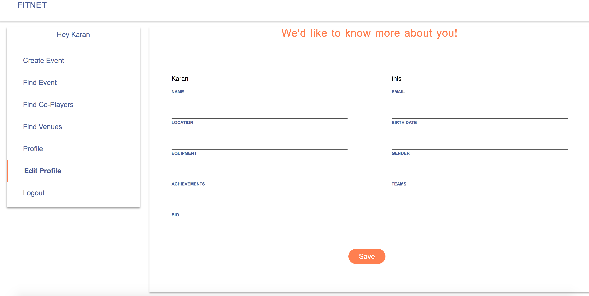

# Fitnet

## Description

Sports are one of the best ways to keep people healthy. But, there are barriers in playing sports such as finding people with the same skill level and a venue. The project deals with this problem by letting users find co-players with the same skill level and a venue. 

The above image is a still form the app.

## Technologies Used

* Node.Js - for server side programming.
* React.Js - for client side programming.
* MongoDB - as a database